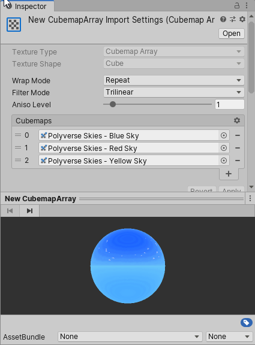

# CubemapArray Import Pipeline for Unity

Unity has no built-in import pipeline for cubemap arrays in Unity 2022.1 and earlier versions yet. This is the relevant quote from their documentation:
> Cubemap arrays do not have an import pipeline for them, and must be created from code, either at runtime or in editor scripts. ([link](https://docs.unity3d.com/ScriptReference/CubemapArray.html))

The CubemapArray Import Pipeline package you're currently looking at tries to fill the gap of that missing import pipeline and provides an implementation to create and modify cubemap arrays.

This CubemapArray Import Pipeline is an editor extension, it does not contain code that is required at runtime.

# Installation

In order to use the CubemapArray Import Pipeline, you have to add the package to your project. As of Unity 2019.3, Unity supports to add packages from git through the Package Manager window.

In Unity's Package Manager, choose "Add package from git URL" and insert one of the Package URL's you can find below.

## Package URL's

| Version  |     Link      |
|----------|---------------|
| 1.5.0 | https://github.com/pschraut/UnityCubemapArrayImportPipeline.git#1.5.0 |
| 1.4.0 | https://github.com/pschraut/UnityCubemapArrayImportPipeline.git#1.4.0 |
| 1.3.0 | https://github.com/pschraut/UnityCubemapArrayImportPipeline.git#1.3.0 |
| 1.2.0 | https://github.com/pschraut/UnityCubemapArrayImportPipeline.git#1.2.0 |
| 1.1.0 | https://github.com/pschraut/UnityCubemapArrayImportPipeline.git#1.1.0 |
| 1.0.0 | https://github.com/pschraut/UnityCubemapArrayImportPipeline.git#1.0.0 |

# Credits

If you find this package useful, please mention my name in your credits screen.
Something like "CubemapArray Import Pipeline by Peter Schraut" or "Thanks to Peter Schraut" would be very much appreciated.

# How it works

## Overview

This CubemapArray Import Pipeline uses Unity's [ScriptedImporter](https://docs.unity3d.com/Manual/ScriptedImporters.html). ScriptedImporter allows to implement custom asset importers in C# for file formats not natively supported by Unity.

CubemapArray is natively supported by Unity, but no import pipeline yet. What I created is a ScriptedImporter that handles files ending with .cubemaparray as a CubemapArray object.

Combined with a custom [ScriptedImporterEditor](https://docs.unity3d.com/ScriptReference/Experimental.AssetImporters.ScriptedImporterEditor.html), I'm pretty happy with the result, as the integration feels quite smooth and you hopefully can't tell that it's not part of built-in Unity.

## Texture format and size

The texture size and format of a CubemapArray is taken from the first input texture, the texture used for slice 0. Thus the CubemapArray asset will have the same size and format as the texture specified in slice 0. All input textures have to use the same size and format.

Input textures are copied into the CubemapArray with no modifications, thus they all need to match. If they don't match, you'll see an error why the CubemapArray could not be created and the CubemapArray is changed to solid magenta to indicate there is an issue that must be fixed.

If you want to use different texture formats/sizes for different target platforms, this is fully supported. You just need to specify the format and size in the input textures, not in the CubemapArray asset.

## Dependency handling

A CubemapArray asset is built from several input textures. The contents of those input textures is copied into the CubemapArray asset.

The import pipeline registers these input textures as dependencies. This means if a texture that is used by a CubemapArray asset changes, the CubemapArray asset gets reimported automatically as well.

It's a really neat feature, as you don't need to hit a rebuild button to update the CubemapArray every time you change one of its input textures.

## Platform handling

If you change the target platform in Unity, for example from PC Standalone to Android, Unity starts to reimport assets for that particular target platform you chose. This will also cause the CubemapArray asset to get reimported and it will use the texture format and size of its input textures.

# Create CubemapArray asset

* Open the project window context menu via right-mouse click.
* Choose "Create > CubemapArray" from the menu. This will create a new CubemapArray asset in the current directory.
* Once you created the asset, it's selected in the Inspector.
* A new CubemapArray has no input textures yet. It only contains a "dummy slice" that is solid magenta to indicate you need to add textures. The CubemapArray at this point is already fully functional though.
* In order to add textures you can click the plus (+) button or just drag&drop your textures onto the list header.
* Add a texture to each slice.
* Press the "Apply" button.

## Import error

If the CubemapArray is still solid magenta after you pressed "Apply", it's very likely there was an issue with the setup. Please take a look at the Unity Console window for any import error. Open the Console from the main menu "Window > General > Console".

A common reason why importing a CubemapArray fails is because the input textures have different sizes or formats. Every texture added to the CubemapArray must have the same size and format, otherwise it won't work.

